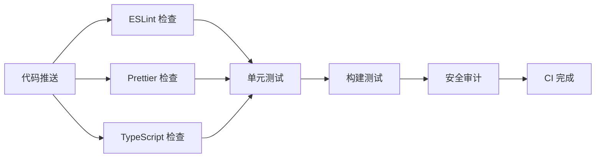
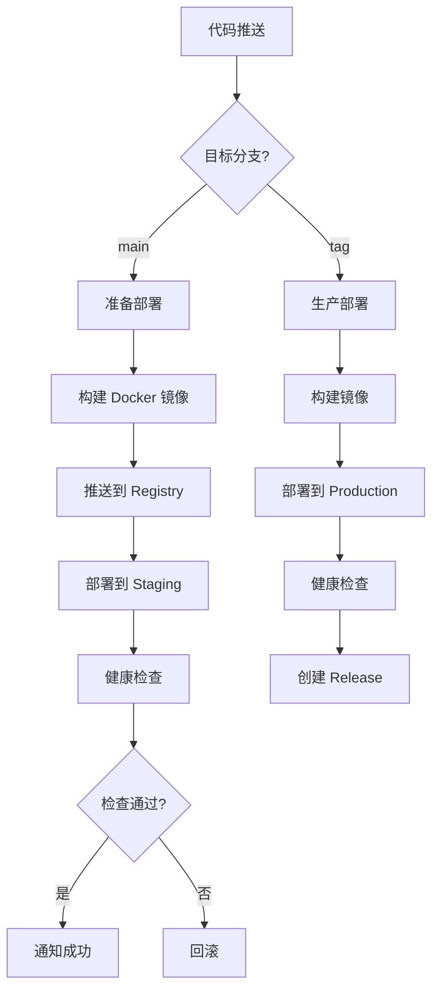

# 🚀 CI/CD 流程指南

本文档详细说明 Zishu 社区平台前端的 CI/CD 流程配置和使用方法。

---

## 📋 目录

- [工作流概览](#工作流概览)
- [环境配置](#环境配置)
- [CI 流程详解](#ci-流程详解)
- [CD 流程详解](#cd-流程详解)
- [发布流程](#发布流程)
- [常见问题](#常见问题)
- [最佳实践](#最佳实践)

---

## 工作流概览

### 持续集成 (CI) 工作流

| 工作流 | 触发时机 | 主要任务 | 执行时间 |
|--------|---------|---------|---------|
| **ci.yml** | Push/PR | 代码检查、测试、构建 | ~5-8分钟 |
| **test.yml** | Push/PR/定时 | E2E 测试、性能测试 | ~15-20分钟 |
| **codeql.yml** | Push/PR/定时 | 安全分析 | ~10-15分钟 |
| **lighthouse.yml** | PR/定时 | 性能分析 | ~8-10分钟 |
| **dependency-review.yml** | PR | 依赖审查 | ~2-3分钟 |

### 持续部署 (CD) 工作流

| 工作流 | 触发时机 | 部署环境 | 执行时间 |
|--------|---------|---------|---------|
| **cd.yml** | Push to main | Staging/Production | ~10-15分钟 |
| **release.yml** | 创建 Tag | Production + Release | ~15-20分钟 |

### 自动化工作流

| 工作流 | 触发时机 | 主要任务 |
|--------|---------|---------|
| **auto-merge.yml** | Dependabot PR | 自动合并依赖更新 |

---

## 环境配置

### 必需的 GitHub Secrets

在 `Settings -> Secrets and variables -> Actions` 中配置以下密钥：

#### Docker Registry
```bash
DOCKER_REGISTRY      # Docker 镜像仓库地址 (例如: registry.example.com)
DOCKER_USERNAME      # Docker 用户名
DOCKER_PASSWORD      # Docker 密码或访问令牌
```

#### Staging 环境
```bash
STAGING_HOST         # Staging 服务器地址
STAGING_USERNAME     # SSH 用户名
STAGING_SSH_KEY      # SSH 私钥
STAGING_SSH_PORT     # SSH 端口 (默认: 22)
STAGING_DEPLOY_PATH  # 部署路径 (例如: /var/www/staging)
STAGING_URL          # Staging 环境 URL (例如: https://staging.zishu.com)
```

#### Production 环境
```bash
PRODUCTION_HOST      # Production 服务器地址
PRODUCTION_USERNAME  # SSH 用户名
PRODUCTION_SSH_KEY   # SSH 私钥
PRODUCTION_SSH_PORT  # SSH 端口 (默认: 22)
PRODUCTION_DEPLOY_PATH  # 部署路径 (例如: /var/www/production)
PRODUCTION_URL       # Production 环境 URL (例如: https://zishu.com)
```

#### 监控和通知
```bash
CODECOV_TOKEN        # Codecov 上传令牌
SLACK_WEBHOOK        # Slack Webhook URL (可选)
LHCI_GITHUB_APP_TOKEN # Lighthouse CI GitHub App Token (可选)
```

### 设置 Secrets 的命令行方式

```bash
# 使用 GitHub CLI
gh secret set DOCKER_REGISTRY --body "registry.example.com"
gh secret set DOCKER_USERNAME --body "your-username"
gh secret set DOCKER_PASSWORD --body "your-password"

# 从文件读取（适合 SSH 密钥）
gh secret set STAGING_SSH_KEY < ~/.ssh/staging_key
```

---

## CI 流程详解

### 1. 代码质量检查 (ci.yml)

#### 工作流程


#### 检查项说明

**Lint 检查**
- ESLint 规则验证
- Prettier 格式化检查
- 失败时：修复 linting 错误

**TypeScript 类型检查**
- 严格模式类型检查
- 编译错误检测
- 失败时：修复类型错误

**单元测试**
- Vitest 单元测试
- 代码覆盖率检查（≥ 80%）
- 失败时：修复失败的测试或提高覆盖率

**构建测试**
- Next.js 生产构建
- Bundle 大小分析
- 失败时：修复构建错误

**安全审计**
- npm audit 安全检查
- 依赖漏洞扫描
- 失败时：更新有漏洞的依赖

### 2. E2E 测试 (test.yml)

#### 多浏览器测试
- **Chromium**: Chrome、Edge
- **Firefox**: Firefox
- **Webkit**: Safari

#### 测试分片
- 4 个分片并行执行
- 提升测试速度
- 每个浏览器 × 4 分片 = 12 个并行任务

#### 测试类型
1. **功能测试**: 核心用户流程
2. **视觉回归测试**: UI 一致性检查
3. **可访问性测试**: WCAG 2.1 AA 合规
4. **性能测试**: Core Web Vitals

### 3. 安全分析 (codeql.yml)

- **CodeQL 静态分析**: 检测常见安全漏洞
- **安全查询集**: security-extended
- **自动化扫描**: 每周三自动运行
- **结果上传**: GitHub Security 标签页

### 4. 性能监控 (lighthouse.yml)

- **Lighthouse 审计**: 性能、可访问性、最佳实践、SEO
- **多页面检查**: 首页、帖子、适配器、角色页面
- **运行次数**: 3 次取中位数
- **性能预算**: Performance ≥ 90

---

## CD 流程详解

### 部署流程架构



### Staging 部署

**触发条件**
- Push to `main` 分支
- 手动触发，选择 `staging` 环境

**部署步骤**
1. 构建 Docker 镜像
2. 推送到 Registry
3. SSH 连接到 Staging 服务器
4. 拉取最新镜像
5. 重启容器
6. 健康检查
7. 发送通知

**回滚策略**
- 保留前 3 个版本的镜像
- 快速回滚到上一版本
- 记录回滚原因

### Production 部署

**触发条件**
- 创建版本 Tag (如 `v1.2.3`)
- 手动触发，选择 `production` 环境

**部署步骤**
1. ✅ 所有 CI 检查必须通过
2. 🔒 需要 Production 环境批准
3. 📦 构建生产镜像
4. 🚀 部署到生产服务器
5. 🏥 健康检查和烟雾测试
6. 📝 创建 GitHub Release
7. 📢 发送部署通知

**安全措施**
- 需要环境保护规则批准
- 仅技术负责人可以批准
- 部署窗口限制（可选）
- 自动化回滚机制

---

## 发布流程

### 语义化版本规范

遵循 [Semantic Versioning 2.0.0](https://semver.org/)：

```
MAJOR.MINOR.PATCH

例如: v1.2.3
  1 = 主版本号 (不兼容的 API 变更)
  2 = 次版本号 (向后兼容的功能新增)
  3 = 修订号 (向后兼容的问题修复)
```

### 发布步骤

#### 方式一：通过 Git Tag

```bash
# 1. 确保在 main 分支
git checkout main
git pull origin main

# 2. 更新版本号
npm version patch  # 或 minor, major

# 3. 推送代码和 Tag
git push && git push --tags

# 4. GitHub Actions 自动触发发布流程
```

#### 方式二：手动触发

```bash
# 通过 GitHub Actions 手动触发
# Actions -> Release -> Run workflow
# 输入版本号: v1.2.3
```

#### 方式三：使用 Release 脚本

创建 `scripts/release.sh`：

```bash
#!/bin/bash

# 获取版本类型
VERSION_TYPE=${1:-patch}

echo "📦 准备发布 $VERSION_TYPE 版本..."

# 运行测试
echo "🧪 运行测试..."
npm run test

# 更新版本号
echo "🔢 更新版本号..."
npm version $VERSION_TYPE

# 获取新版本号
NEW_VERSION=$(node -p "require('./package.json').version")
echo "✨ 新版本: v$NEW_VERSION"

# 推送代码和 Tag
echo "🚀 推送代码..."
git push && git push --tags

echo "✅ 发布流程已触发！"
echo "📊 查看进度: https://github.com/zishu/community-platform/actions"
```

使用方式：
```bash
# 补丁版本
./scripts/release.sh patch

# 次版本
./scripts/release.sh minor

# 主版本
./scripts/release.sh major
```

### Changelog 自动生成

发布时会自动生成 Changelog，包含：

- ✨ 新功能 (feat)
- 🐛 Bug 修复 (fix)
- 📝 文档更新 (docs)
- 🔧 其他更改 (chore)

确保提交信息遵循 [Conventional Commits](https://www.conventionalcommits.org/)：

```bash
feat: 添加用户个人主页
fix: 修复登录按钮点击无响应问题
docs: 更新 API 文档
chore: 升级依赖包
```

---

## 常见问题

### Q1: CI 检查失败怎么办？

**步骤**：
1. 查看失败的检查项
2. 在本地运行相同的命令
3. 修复问题并重新提交
4. 重新触发 CI

**常见失败原因**：
- ESLint 错误: `npm run lint:fix`
- 格式问题: `npm run format`
- 测试失败: `npm run test`
- 构建错误: `npm run build`

### Q2: 如何在本地测试 CI 流程？

```bash
# 完整的本地验证流程
npm run validate  # lint + type-check + format-check
npm run test:coverage  # 运行测试并生成覆盖率
npm run build  # 构建项目
```

### Q3: 如何跳过 CI 检查？

**不推荐**，但紧急情况下可以：
```bash
git commit -m "fix: critical hotfix [skip ci]"
```

**注意**: main 分支有分支保护，无法跳过必需检查。

### Q4: 部署失败如何回滚？

**Staging 回滚**：
```bash
# SSH 到 Staging 服务器
ssh user@staging-server

# 回滚到上一版本
cd /var/www/staging
docker-compose down
docker tag registry/zishu-frontend:previous registry/zishu-frontend:latest
docker-compose up -d
```

**Production 回滚**：
```bash
# 创建回滚 PR 或使用 Git revert
git revert <commit-hash>
git push origin main

# 或者直接部署上一版本
gh workflow run cd.yml -f environment=production -f version=v1.2.2
```

### Q5: 如何添加新的 CI 检查？

1. 编辑 `.github/workflows/ci.yml`
2. 添加新的 job 或 step
3. 更新分支保护规则（将新检查添加到必需检查中）

示例：添加 Bundle 大小检查
```yaml
- name: Bundle 大小分析
  run: npx @next/bundle-analyzer
```

### Q6: Docker 镜像构建失败？

**常见原因**：
- Dockerfile 路径错误
- 依赖安装失败
- 内存不足

**解决方法**：
```bash
# 本地测试 Docker 构建
docker build -t test-build .

# 查看构建日志
docker build --progress=plain -t test-build .

# 使用多阶段构建减少镜像大小
```

### Q7: E2E 测试不稳定怎么办？

**提高稳定性**：
1. 增加超时时间
2. 添加显式等待
3. 使用数据属性选择器
4. 隔离测试环境
5. 使用 Mock 数据

```typescript
// 不好的做法
await page.click('.button');

// 好的做法
await page.click('[data-testid="submit-button"]');
await page.waitForLoadState('networkidle');
```

---

## 最佳实践

### 1. 提交规范

**使用 Conventional Commits**
```bash
<type>(<scope>): <subject>

类型 (type):
- feat: 新功能
- fix: Bug 修复
- docs: 文档更新
- style: 代码格式化
- refactor: 代码重构
- perf: 性能优化
- test: 测试相关
- chore: 构建/工具更改
- ci: CI 配置更改

示例:
feat(auth): 添加 Google 登录支持
fix(post): 修复帖子编辑器图片上传问题
docs(readme): 更新安装说明
```

### 2. 分支策略

```
main (生产分支)
  ↑
develop (开发分支)
  ↑
feature/xxx (功能分支)
```

**工作流程**：
1. 从 `develop` 创建功能分支
2. 开发完成后提交 PR 到 `develop`
3. Code Review 通过后合并
4. 定期将 `develop` 合并到 `main`
5. 从 `main` 创建 Release Tag

### 3. PR 最佳实践

**好的 PR**：
- ✅ 单一职责，一个 PR 只做一件事
- ✅ 提交信息清晰
- ✅ 有完整的描述和测试说明
- ✅ 代码变更不超过 400 行
- ✅ 包含必要的测试
- ✅ 更新相关文档

**不好的 PR**：
- ❌ 包含多个不相关的变更
- ❌ 没有描述或测试说明
- ❌ 超过 1000 行代码变更
- ❌ 没有测试覆盖
- ❌ 直接修改配置文件但没有说明

### 4. 测试策略

**测试金字塔**：
```
      /\
     /  \    E2E 测试 (10%)
    /----\   
   /      \  集成测试 (20%)
  /--------\ 
 /          \ 单元测试 (70%)
/____________\
```

**覆盖率要求**：
- 单元测试: ≥ 80%
- 关键路径: 100%
- 边界情况: 完整覆盖

### 5. 性能优化

**CI 性能优化**：
- 使用依赖缓存
- 并行执行任务
- 增量构建
- Docker 层缓存

```yaml
# 使用缓存
- uses: actions/cache@v4
  with:
    path: |
      ~/.npm
      .next/cache
    key: ${{ runner.os }}-npm-${{ hashFiles('package-lock.json') }}
```

### 6. 安全实践

**保护敏感信息**：
- ✅ 使用 GitHub Secrets
- ✅ 不在代码中硬编码密钥
- ✅ 定期轮换密钥
- ✅ 最小权限原则

**依赖安全**：
- ✅ 启用 Dependabot
- ✅ 定期运行 npm audit
- ✅ 自动合并安全补丁
- ✅ 审查依赖许可证

### 7. 监控和告警

**关键指标**：
- CI 成功率
- 平均构建时间
- 部署频率
- 失败率

**告警设置**：
- CI 连续失败 > 3 次
- 构建时间 > 10 分钟
- 测试覆盖率下降 > 5%
- 安全漏洞发现

---

## 工具和资源

### GitHub Actions 相关
- [官方文档](https://docs.github.com/en/actions)
- [Marketplace](https://github.com/marketplace?type=actions)
- [awesome-actions](https://github.com/sdras/awesome-actions)

### 测试工具
- [Playwright](https://playwright.dev/)
- [Vitest](https://vitest.dev/)
- [Testing Library](https://testing-library.com/)

### 性能工具
- [Lighthouse CI](https://github.com/GoogleChrome/lighthouse-ci)
- [Web Vitals](https://web.dev/vitals/)
- [Bundle Analyzer](https://www.npmjs.com/package/@next/bundle-analyzer)

### 安全工具
- [CodeQL](https://codeql.github.com/)
- [npm audit](https://docs.npmjs.com/cli/v8/commands/npm-audit)
- [Dependabot](https://github.com/dependabot)

---

## 维护和更新

### 定期检查清单

**每周**：
- [ ] 检查 CI 失败趋势
- [ ] 更新依赖包
- [ ] 审查 Security Alerts

**每月**：
- [ ] 评估 CI 性能
- [ ] 优化工作流配置
- [ ] 更新文档

**每季度**：
- [ ] 审查分支保护规则
- [ ] 评估测试覆盖率
- [ ] 性能基准测试

---

## 联系和支持

**问题反馈**：
- 创建 Issue: [GitHub Issues](https://github.com/zishu/community-platform/issues)
- 技术讨论: [GitHub Discussions](https://github.com/zishu/community-platform/discussions)

**负责团队**：
- DevOps: @devops-team
- 前端技术负责人: @tech-lead

---

**文档维护者**: DevOps Team  
**最后更新**: 2025-10-23  
**版本**: 1.0.0

