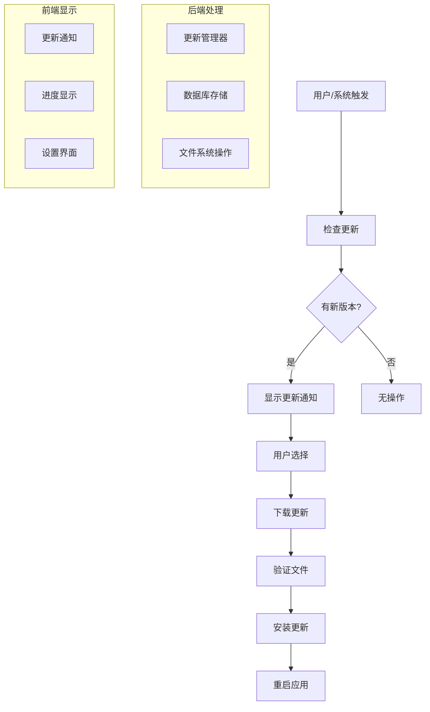

# 紫舒老师更新系统文档

> 生成日期：2025-10-20  
> 版本：v1.0.0  
> 状态：已完成

---

## 📋 概述

本文档介绍紫舒老师桌面应用的更新系统，包括自动更新检查、增量更新、版本回滚、兼容性检查等核心功能。更新系统基于 Tauri 的内置更新器，结合自定义的管理逻辑，为用户提供无缝的更新体验。

### 🎯 设计目标

- **🔄 自动化更新**：支持自动检查、下载和安装更新
- **📦 增量更新**：优化下载大小，提高更新效率
- **🔙 版本回滚**：支持回滚到之前的版本
- **✅ 兼容性检查**：确保更新不会破坏现有功能
- **📝 版本日志**：清晰展示更新内容和变更
- **🛡️ 安全验证**：文件哈希校验，确保更新安全性

---

## 🏗️ 系统架构

### 核心组件

```
更新系统
├── 后端 (Rust/Tauri)
│   ├── 数据库模型 (database/update.rs)
│   ├── 更新管理器 (utils/update_manager.rs)
│   └── Tauri 命令 (commands/update.rs)
├── 前端 (TypeScript/React)
│   ├── 类型定义 (types/update.ts)
│   ├── 服务层 (services/updateService.ts)
│   ├── React Hooks (hooks/useUpdate.ts)
│   └── UI 组件 (components/Update/)
└── 配置
    └── Tauri 更新器配置 (tauri.conf.json)
```

### 数据流



---

## 📊 数据模型

### 更新信息 (UpdateInfo)

```rust
pub struct UpdateInfo {
    pub id: Option<i64>,                    // 更新 ID
    pub version: String,                    // 版本号
    pub update_type: UpdateType,            // 更新类型
    pub status: UpdateStatus,               // 更新状态
    pub title: String,                      // 更新标题
    pub description: String,                // 更新描述
    pub changelog: String,                  // 更新日志
    pub release_date: DateTime<Utc>,        // 发布时间
    pub file_size: Option<i64>,             // 文件大小
    pub download_url: Option<String>,       // 下载链接
    pub file_hash: Option<String>,          // 文件哈希
    pub is_mandatory: bool,                 // 是否强制更新
    pub is_prerelease: bool,                // 是否预发布版本
    pub min_version: Option<String>,        // 最小支持版本
    pub target_platform: Option<String>,   // 目标平台
    pub target_arch: Option<String>,        // 目标架构
    pub download_progress: f64,             // 下载进度
    pub install_progress: f64,              // 安装进度
    pub error_message: Option<String>,      // 错误信息
    pub retry_count: i32,                   // 重试次数
    pub created_at: DateTime<Utc>,          // 创建时间
    pub updated_at: DateTime<Utc>,          // 更新时间
}
```

### 更新状态 (UpdateStatus)

- `None` - 无更新可用
- `Available` - 有更新可用
- `Downloading` - 正在下载
- `Downloaded` - 已下载，待安装
- `Installing` - 正在安装
- `Installed` - 安装完成
- `Failed` - 更新失败
- `Paused` - 已暂停
- `Cancelled` - 已取消

### 更新类型 (UpdateType)

- `Major` - 主要版本更新（破坏性变更）
- `Minor` - 次要版本更新（新功能）
- `Patch` - 补丁更新（Bug 修复）
- `Hotfix` - 热修复更新
- `Security` - 安全更新

### 版本历史 (VersionHistory)

```rust
pub struct VersionHistory {
    pub id: Option<i64>,            // 记录 ID
    pub version: String,            // 版本号
    pub installed_at: DateTime<Utc>, // 安装时间
    pub is_rollback: bool,          // 是否回滚
    pub install_source: String,     // 安装来源
    pub notes: Option<String>,      // 备注
}
```

### 更新配置 (UpdateConfig)

```rust
pub struct UpdateConfig {
    pub id: Option<i64>,                        // 配置 ID
    pub auto_check_enabled: bool,               // 自动检查开关
    pub check_interval_hours: i32,              // 检查间隔（小时）
    pub auto_download_enabled: bool,            // 自动下载开关
    pub auto_install_enabled: bool,             // 自动安装开关
    pub include_prerelease: bool,               // 包含预发布版本
    pub update_channel: String,                 // 更新通道
    pub allowed_network_types: String,          // 允许的网络类型
    pub max_retry_count: i32,                   // 最大重试次数
    pub download_timeout_seconds: i32,          // 下载超时时间
    pub backup_before_update: bool,             // 更新前备份
    pub max_backup_count: i32,                  // 最大备份数量
    pub last_check_time: Option<DateTime<Utc>>, // 上次检查时间
    pub created_at: DateTime<Utc>,              // 创建时间
    pub updated_at: DateTime<Utc>,              // 更新时间
}
```

---

## 🔧 核心功能

### 1. 自动更新检查

**功能描述**：根据配置自动检查是否有新版本可用。

**实现原理**：
1. 根据配置的检查间隔定期向更新服务器发起请求
2. 比较本地版本与远程版本号
3. 验证兼容性和最小版本要求
4. 更新数据库记录和状态

**关键代码**：
```rust
pub async fn check_for_updates(&self, force: bool) -> Result<Option<UpdateInfo>> {
    // 检查配置和时间间隔
    // 构建请求 URL
    // 发送 HTTP 请求获取更新清单
    // 比较版本号
    // 验证兼容性
    // 保存更新信息到数据库
}
```

### 2. 增量更新下载

**功能描述**：智能下载更新文件，支持断点续传和进度显示。

**实现原理**：
1. 从更新清单获取下载链接和文件信息
2. 使用 HTTP 分块下载，支持进度回调
3. 实时计算和验证文件哈希
4. 支持暂停、取消和重试机制

**关键代码**：
```rust
pub async fn download_update(&self, version: &str) -> Result<String> {
    // 获取更新信息和下载链接
    // 创建下载任务和进度跟踪
    // 分块下载文件内容
    // 实时计算哈希值
    // 验证文件完整性
    // 发送进度事件
}
```

### 3. 安全安装更新

**功能描述**：安全地安装下载的更新文件。

**实现原理**：
1. 验证下载文件的哈希值
2. 创建当前版本的备份（可选）
3. 调用 Tauri 更新器执行安装
4. 记录版本历史和安装信息
5. 处理安装失败的回滚

**关键代码**：
```rust
pub async fn install_update(&self, version: &str) -> Result<bool> {
    // 验证文件哈希
    // 创建备份（可选）
    // 调用 Tauri 更新器
    // 记录版本历史
    // 返回是否需要重启
}
```

### 4. 版本回滚

**功能描述**：支持回滚到之前安装的版本。

**实现原理**：
1. 从版本历史中查找目标版本
2. 检查备份文件的可用性
3. 执行回滚操作
4. 更新版本历史记录

**限制说明**：
- 由于 Tauri 更新器的限制，完整的回滚功能需要重新下载目标版本
- 当前实现主要记录回滚意图，实际回滚需要用户手动操作

### 5. 兼容性检查

**功能描述**：确保更新版本与当前环境兼容。

**检查项目**：
- 最小版本要求
- 平台和架构匹配
- 依赖项兼容性
- 配置文件兼容性

### 6. 更新日志展示

**功能描述**：展示详细的更新内容和变更信息。

**支持格式**：
- Markdown 格式的更新日志
- HTML 渲染显示
- 多语言支持

---

## 🎨 用户界面

### 1. 更新通知 (UpdateNotification)

**位置**：`src/components/common/UpdateNotification.tsx`

**功能特性**：
- 🔔 自动显示更新通知
- 📊 实时进度显示
- 🎛️ 多种操作选项（立即更新、仅下载、稍后提醒）
- 📱 响应式设计
- 🎨 可自定义位置和样式
- 🖱️ 支持拖拽移动

**使用示例**：
```tsx
<UpdateNotification 
  autoCheck={true}
  checkInterval={60000}
  showDetails={true}
  position="top-right"
  draggable={true}
/>
```

### 2. 更新管理器 (UpdateManager)

**位置**：`src/components/Update/UpdateManager.tsx`

**功能模块**：
- **概览页面**：显示当前状态和可用更新
- **设置页面**：配置更新策略和参数
- **历史页面**：查看版本历史和回滚操作
- **统计页面**：更新成功率和统计信息

**标签页导航**：
```tsx
const tabs = [
  { id: 'overview', label: '概览', icon: Info },
  { id: 'settings', label: '设置', icon: Settings },
  { id: 'history', label: '历史', icon: History },
  { id: 'stats', label: '统计', icon: BarChart3 },
];
```

---

## 🎯 API 接口

### Tauri 命令

| 命令名称 | 参数 | 返回值 | 说明 |
|---------|------|-------|------|
| `init_update_manager` | - | `bool` | 初始化更新管理器 |
| `check_for_updates` | `force?: bool` | `UpdateCheckResult` | 检查更新 |
| `download_update` | `version: string` | `string` | 下载更新 |
| `install_update` | `version: string` | `bool` | 安装更新 |
| `install_update_with_tauri` | - | `bool` | 使用 Tauri 更新器安装 |
| `cancel_download` | `version: string` | `bool` | 取消下载 |
| `rollback_to_version` | `version: string` | `bool` | 回滚版本 |
| `get_update_config` | - | `UpdateConfig` | 获取更新配置 |
| `save_update_config` | `config: UpdateConfig` | `bool` | 保存更新配置 |
| `get_version_history` | - | `VersionHistory[]` | 获取版本历史 |
| `get_update_stats` | - | `Record<string, number>` | 获取更新统计 |
| `cleanup_old_files` | - | `bool` | 清理旧文件 |
| `restart_application` | - | `bool` | 重启应用 |
| `listen_update_events` | - | `bool` | 监听更新事件 |
| `check_tauri_updater_available` | - | `bool` | 检查 Tauri 更新器可用性 |
| `get_current_version` | - | `string` | 获取当前版本 |

### 事件系统

**更新事件类型**：
```typescript
export type UpdateEvent = 
  | { type: "CheckStarted" }
  | { type: "CheckCompleted"; data: { has_update: boolean; update_info?: UpdateInfo } }
  | { type: "CheckFailed"; data: { error: string } }
  | { type: "DownloadStarted"; data: { version: string; total_size?: number } }
  | { type: "DownloadProgress"; data: { version: string; downloaded: number; total?: number; percentage: number } }
  | { type: "DownloadCompleted"; data: { version: string; file_path: string } }
  | { type: "DownloadFailed"; data: { version: string; error: string } }
  | { type: "InstallStarted"; data: { version: string } }
  | { type: "InstallProgress"; data: { version: string; percentage: number; message: string } }
  | { type: "InstallCompleted"; data: { version: string; needs_restart: boolean } }
  | { type: "InstallFailed"; data: { version: string; error: string } }
  | { type: "RollbackStarted"; data: { from_version: string; to_version: string } }
  | { type: "RollbackCompleted"; data: { version: string } }
  | { type: "RollbackFailed"; data: { error: string } };
```

---

## 🔌 React Hooks

### 核心 Hooks

| Hook 名称 | 功能 | 返回值 |
|-----------|------|-------|
| `useUpdateManager` | 更新管理器状态 | `{ isInitialized, isInitializing, initError, initialize }` |
| `useUpdateCheck` | 更新检查功能 | `{ updateInfo, hasUpdate, isChecking, checkError, checkForUpdates, ... }` |
| `useUpdateDownload` | 更新下载功能 | `{ isDownloading, downloadProgress, downloadError, downloadUpdate, ... }` |
| `useUpdateInstall` | 更新安装功能 | `{ isInstalling, installProgress, installError, installUpdate, ... }` |
| `useUpdateConfig` | 更新配置管理 | `{ config, isLoading, error, saveConfig, updateConfig, ... }` |
| `useVersionHistory` | 版本历史管理 | `{ history, isLoading, error, rollbackToVersion, ... }` |
| `useUpdateStats` | 更新统计信息 | `{ stats, isLoading, error, loadStats }` |
| `useUpdateEvents` | 更新事件监听 | `{ events, latestEvent, clearEvents }` |
| `useUpdateFlow` | 完整更新流程 | `{ currentStep, progress, error, startUpdateFlow, ... }` |
| `useAppVersion` | 应用版本信息 | `{ currentVersion, isLoading, error, loadVersion }` |

### 使用示例

```tsx
import { useUpdateCheck, useUpdateConfig } from '../hooks/useUpdate';

const UpdateComponent: React.FC = () => {
  const { updateInfo, hasUpdate, checkForUpdates } = useUpdateCheck();
  const { config, updateConfig, saveConfig } = useUpdateConfig();

  return (
    <div>
      {hasUpdate && (
        <div>有新版本 {updateInfo?.version} 可用！</div>
      )}
      <button onClick={() => checkForUpdates(true)}>
        检查更新
      </button>
    </div>
  );
};
```

---

## ⚙️ 配置说明

### Tauri 更新器配置

**位置**：`src-tauri/tauri.conf.json`

```json
{
  "tauri": {
    "updater": {
      "active": true,
      "endpoints": [
        "https://update.zishu.dev/{{target}}/{{arch}}/{{current_version}}"
      ],
      "dialog": true,
      "pubkey": "更新签名公钥"
    }
  }
}
```

**配置项说明**：
- `active`: 启用更新器
- `endpoints`: 更新检查端点，支持模板变量
- `dialog`: 显示更新对话框
- `pubkey`: 用于验证更新包签名的公钥

### 更新服务器端点

**端点格式**：
```
https://update.zishu.dev/{platform}/{arch}/{current_version}
```

**响应格式**：
```json
{
  "version": "1.1.0",
  "release_date": "2025-10-20T10:00:00Z",
  "update_type": "Minor",
  "title": "功能更新",
  "description": "新增多项功能和性能优化",
  "changelog": "## 新功能\n- 功能 A\n- 功能 B\n\n## 修复\n- 修复 Bug X",
  "is_mandatory": false,
  "is_prerelease": false,
  "min_version": "1.0.0",
  "files": {
    "windows-x86_64": {
      "url": "https://update.zishu.dev/releases/v1.1.0/zishu-sensei-1.1.0-windows-x86_64.exe",
      "size": 52428800,
      "hash": "sha256-hash-here"
    }
  }
}
```

---

## 🚀 部署和使用

### 1. 初始化更新系统

```typescript
import { updateUtils } from './services/updateService';

// 应用启动时初始化
await updateUtils.initializeUpdateSystem();
```

### 2. 集成更新通知

```tsx
import { UpdateNotification } from './components/Update';

const App: React.FC = () => {
  return (
    <div>
      {/* 其他组件 */}
      <UpdateNotification autoCheck={true} />
    </div>
  );
};
```

### 3. 添加更新管理界面

```tsx
import { UpdateManager } from './components/Update';

const SettingsPage: React.FC = () => {
  return (
    <div>
      <UpdateManager />
    </div>
  );
};
```

### 4. 自定义更新流程

```typescript
import { updateOperations } from './services/updateService';

// 执行完整更新流程
const handleUpdate = async (version: string) => {
  try {
    const needsRestart = await updateOperations.performFullUpdate(
      version,
      (event) => {
        console.log('更新事件:', event);
      }
    );
    
    if (needsRestart) {
      // 提示用户重启
    }
  } catch (error) {
    console.error('更新失败:', error);
  }
};
```

---

## 🔍 故障排除

### 常见问题

1. **更新检查失败**
   - 检查网络连接
   - 验证更新服务器端点
   - 查看错误日志

2. **下载失败**
   - 检查磁盘空间
   - 验证文件权限
   - 重试下载

3. **安装失败**
   - 检查应用权限
   - 关闭防病毒软件
   - 手动安装更新包

4. **Tauri 更新器不可用**
   - 检查 Tauri 版本
   - 验证配置文件
   - 查看平台支持情况

### 调试方法

1. **启用调试日志**：
```rust
// 在 main.rs 中启用调试日志
tracing_subscriber::fmt()
    .with_max_level(tracing::Level::DEBUG)
    .init();
```

2. **查看更新事件**：
```typescript
import { useUpdateEvents } from './hooks/useUpdate';

const DebugComponent = () => {
  useUpdateEvents((event) => {
    console.log('更新事件:', event);
  });
  return null;
};
```

3. **检查数据库状态**：
```sql
-- 查看更新记录
SELECT * FROM update_info ORDER BY created_at DESC;

-- 查看版本历史
SELECT * FROM version_history ORDER BY installed_at DESC;

-- 查看更新配置
SELECT * FROM update_config;
```

---

## 📈 性能优化

### 1. 减少网络请求

- 合理设置检查间隔
- 使用条件请求（If-Modified-Since）
- 启用响应缓存

### 2. 优化下载性能

- 使用 CDN 分发更新文件
- 支持断点续传
- 压缩更新包

### 3. 改善用户体验

- 后台下载更新
- 显示详细进度信息
- 提供取消和暂停选项

### 4. 数据库优化

- 定期清理旧记录
- 添加适当的索引
- 优化查询语句

---

## 🔐 安全考虑

### 1. 文件验证

- SHA256 哈希校验
- 数字签名验证
- 来源可信度检查

### 2. 网络安全

- 使用 HTTPS 传输
- 验证服务器证书
- 防止中间人攻击

### 3. 权限控制

- 最小权限原则
- 用户确认机制
- 沙盒环境隔离

### 4. 错误处理

- 安全的错误信息
- 防止信息泄露
- 恶意文件检测

---

## 🧪 测试策略

### 单元测试

```rust
#[cfg(test)]
mod tests {
    use super::*;

    #[tokio::test]
    async fn test_version_comparison() {
        let manager = UpdateManager::new(/* ... */)?;
        let result = manager.compare_versions("1.0.0", "1.1.0");
        assert_eq!(result, VersionComparison::UpdateAvailable);
    }

    #[test]
    fn test_update_config_validation() {
        let config = UpdateConfig::default();
        assert!(config.auto_check_enabled);
        assert_eq!(config.check_interval_hours, 24);
    }
}
```

### 集成测试

```typescript
import { render, screen, waitFor } from '@testing-library/react';
import { UpdateNotification } from './UpdateNotification';

test('should display update notification', async () => {
  render(<UpdateNotification autoCheck={false} />);
  
  // 模拟更新检查
  // 验证通知显示
  // 测试用户交互
});
```

### 端到端测试

使用 Playwright 或 Tauri 测试工具：

```typescript
import { test, expect } from '@playwright/test';

test('complete update flow', async ({ page }) => {
  await page.goto('/');
  
  // 触发更新检查
  await page.click('[data-testid="check-update"]');
  
  // 等待更新通知
  await expect(page.locator('.update-notification')).toBeVisible();
  
  // 执行更新流程
  await page.click('[data-testid="install-update"]');
  
  // 验证更新完成
  await expect(page.locator('.update-success')).toBeVisible();
});
```

---

## 📚 最佳实践

### 1. 版本管理

- 使用语义化版本号（Semantic Versioning）
- 明确版本兼容性规则
- 提供详细的更新日志

### 2. 用户体验

- 提供清晰的更新进度指示
- 允许用户选择更新时机
- 保持界面响应性

### 3. 错误处理

- 提供有意义的错误信息
- 实现自动重试机制
- 支持回滚和恢复

### 4. 性能优化

- 后台执行更新操作
- 优化网络请求频率
- 缓存更新检查结果

### 5. 安全规范

- 验证所有下载文件
- 使用安全的传输协议
- 实施访问权限控制

---

## 🔄 未来规划

### 短期改进

- [ ] 支持差分更新（delta updates）
- [ ] 添加更新进度预估
- [ ] 优化大文件下载性能
- [ ] 增强错误恢复机制

### 中期目标

- [ ] 支持多渠道更新（stable/beta/alpha）
- [ ] 实现 A/B 测试功能
- [ ] 添加更新统计和分析
- [ ] 支持自定义更新策略

### 长期愿景

- [ ] 智能更新推荐
- [ ] 机器学习驱动的更新优化
- [ ] 云端配置管理
- [ ] 跨平台统一更新体验

---

## 📞 技术支持

如果在使用更新系统过程中遇到问题，可以：

1. 查看应用日志文件
2. 检查更新配置设置
3. 访问项目 GitHub Issues
4. 联系开发团队支持

---

## 📄 相关文档

- [Tauri 更新器官方文档](https://tauri.app/v1/guides/distribution/updater)
- [语义化版本规范](https://semver.org/lang/zh-CN/)
- [数字签名最佳实践](https://docs.microsoft.com/en-us/windows-hardware/drivers/dashboard/code-signing-best-practices)

---

**文档维护者**: 开发团队  
**最后更新**: 2025-10-20  
**版本**: 1.0.0
