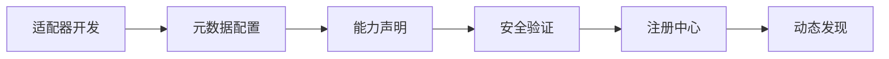
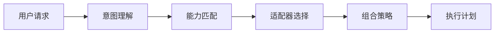
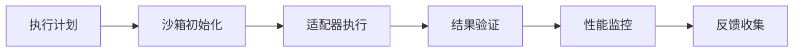
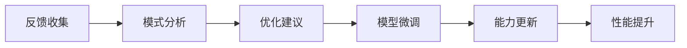

# 🧩 Zishu 适配器框架开发思路

## 📋 **适配器框架核心理念**

Zishu 适配器框架基于 **"软硬混合，智能组合"** 的革新思路，将传统的软适配器（基于提示词）和硬适配器（基于代码）进行统一，并引入全新的 **智能硬适配器（基于微调模型）** 概念。

### 🎯 **设计目标**

1. **统一接口**: 所有适配器都遵循相同的基础接口，确保无缝组合
2. **能力扩展**: 从简单的提示词增强到复杂的专业AI专家
3. **安全可控**: 严格的沙箱隔离和权限控制
4. **社区生态**: 开放的适配器开发和分享平台
5. **持续进化**: 基于使用反馈的自主学习和优化

## 🏗️ **适配器分类体系**

### 1️⃣ **软适配器 (Soft Adapters)**
```yaml
描述: 基于提示词工程和RAG技术的AI能力增强
实现方式: 动态提示模板 + 向量检索 + 上下文注入
适用场景: 知识问答、内容生成、语言理解
技术栈: Prompt Engineering + Vector DB + Embedding

核心组件:
  - PromptEngine: 动态提示模板生成器
  - RAGEngine: 检索增强生成引擎  
  - VectorStore: 向量数据库管理
  - KnowledgeBase: 知识库构建和维护
  - ContextManager: 上下文管理器
```

### 2️⃣ **硬适配器 (Hard Adapters)**
```yaml
描述: 基于原生代码实现的系统级操作能力
实现方式: Python/C++原生代码 + 系统API调用
适用场景: 桌面操作、文件处理、系统集成
技术栈: Python + Native APIs + OS Integration

核心组件:
  - DesktopController: 桌面操作控制器
  - FileSystemAdapter: 文件系统适配器
  - ApplicationAdapter: 应用程序集成适配器
  - NetworkAdapter: 网络服务适配器
  - SystemAdapter: 系统级API适配器
```

### 3️⃣ **智能硬适配器 (Intelligent Hard Adapters)** 🆕
```yaml
描述: 基于专业微调模型的智能代码生成和执行
实现方式: 专业微调模型 + 安全代码执行 + 自主学习
适用场景: 数据分析、办公自动化、代码生成、创意设计
技术栈: Fine-tuned LLM + Code Execution + Continuous Learning

核心组件:
  - SpecialistModel: 专业领域微调模型
  - CodeGenerator: 智能代码生成器
  - SafeExecutor: 安全代码执行引擎
  - LearningEngine: 持续学习引擎
  - PerformanceMonitor: 性能监控器
```

## 🔄 **适配器框架工作流程**

### **阶段1: 适配器注册与发现**


### **阶段2: 请求路由与适配器选择**


### **阶段3: 适配器执行与监控**


### **阶段4: 持续学习与优化**


## 🛠️ **适配器开发思路**

### **1. 基础接口设计**

```python
from abc import ABC, abstractmethod
from typing import Any, Dict, List, Optional, Union
from dataclasses import dataclass
from enum import Enum

class AdapterType(Enum):
    """适配器类型枚举"""
    SOFT = "soft"                    # 软适配器
    HARD = "hard"                    # 硬适配器  
    INTELLIGENT = "intelligent"      # 智能硬适配器

class CapabilityLevel(Enum):
    """能力等级枚举"""
    BASIC = "basic"                  # 基础能力
    INTERMEDIATE = "intermediate"    # 中级能力
    ADVANCED = "advanced"           # 高级能力
    EXPERT = "expert"               # 专家级能力

@dataclass
class AdapterCapability:
    """适配器能力描述"""
    name: str                       # 能力名称
    description: str                # 能力描述
    level: CapabilityLevel         # 能力等级
    inputs: List[str]              # 输入类型
    outputs: List[str]             # 输出类型
    dependencies: List[str]        # 依赖项
    
@dataclass
class AdapterMetadata:
    """适配器元数据"""
    id: str                        # 适配器唯一标识
    name: str                      # 显示名称
    version: str                   # 版本号
    author: str                    # 作者
    description: str               # 详细描述
    category: str                  # 分类
    tags: List[str]               # 标签
    adapter_type: AdapterType      # 适配器类型
    capabilities: List[AdapterCapability]  # 能力列表
    requirements: Dict[str, Any]   # 系统要求
    permissions: Dict[str, bool]   # 权限需求

class BaseAdapter(ABC):
    """适配器基础抽象类"""
    
    def __init__(self, config: Dict[str, Any]):
        self.config = config
        self.metadata = self._load_metadata()
        self.is_initialized = False
        self.performance_metrics = {}
    
    @abstractmethod
    def _load_metadata(self) -> AdapterMetadata:
        """加载适配器元数据"""
        pass
    
    @abstractmethod
    def initialize(self) -> bool:
        """初始化适配器"""
        pass
    
    @abstractmethod
    def process(self, input_data: Any, context: Dict[str, Any]) -> Any:
        """处理输入数据"""
        pass
    
    @abstractmethod
    def get_capabilities(self) -> List[AdapterCapability]:
        """获取适配器能力列表"""
        pass
    
    @abstractmethod
    def health_check(self) -> Dict[str, Any]:
        """健康检查"""
        pass
    
    @abstractmethod
    def cleanup(self) -> None:
        """清理资源"""
        pass
    
    def get_metadata(self) -> AdapterMetadata:
        """获取元数据"""
        return self.metadata
    
    def get_performance_metrics(self) -> Dict[str, Any]:
        """获取性能指标"""
        return self.performance_metrics
```

### **2. 软适配器实现思路**

```python
class SoftAdapter(BaseAdapter):
    """软适配器基类"""
    
    def __init__(self, config: Dict[str, Any]):
        super().__init__(config)
        self.prompt_engine = PromptEngine()
        self.rag_engine = RAGEngine()
        self.vector_store = VectorStore()
        self.knowledge_base = KnowledgeBase()
    
    def process(self, input_data: Any, context: Dict[str, Any]) -> Any:
        """软适配器处理流程"""
        
        # 1. 意图理解和上下文分析
        intent = self._analyze_intent(input_data, context)
        
        # 2. 相关知识检索
        relevant_knowledge = self.rag_engine.retrieve(
            query=intent.query,
            context=context,
            top_k=self.config.get('top_k', 5)
        )
        
        # 3. 动态提示词构建
        prompt = self.prompt_engine.build_prompt(
            intent=intent,
            knowledge=relevant_knowledge,
            context=context,
            template=self.config.get('prompt_template')
        )
        
        # 4. LLM推理生成
        response = self._generate_response(prompt, context)
        
        # 5. 后处理和验证
        result = self._post_process(response, context)
        
        return result
    
    def _analyze_intent(self, input_data: Any, context: Dict[str, Any]):
        """意图分析"""
        # 实现意图理解逻辑
        pass
    
    def _generate_response(self, prompt: str, context: Dict[str, Any]):
        """生成响应"""
        # 调用LLM进行推理
        pass
    
    def _post_process(self, response: str, context: Dict[str, Any]):
        """后处理"""
        # 实现响应后处理逻辑
        pass
```

### **3. 智能硬适配器实现思路**

```python
class IntelligentHardAdapter(BaseAdapter):
    """智能硬适配器基类"""
    
    def __init__(self, config: Dict[str, Any]):
        super().__init__(config)
        self.specialist_model = SpecialistModel(config['model_path'])
        self.code_generator = CodeGenerator()
        self.safe_executor = SafeExecutor()
        self.learning_engine = LearningEngine()
        self.performance_monitor = PerformanceMonitor()
    
    async def process(self, input_data: Any, context: Dict[str, Any]) -> Any:
        """智能硬适配器处理流程"""
        
        # 1. 专业理解和规划
        understanding = await self.specialist_model.analyze_request(
            request=input_data,
            context=context,
            domain_knowledge=self.get_domain_knowledge()
        )
        
        # 2. 执行计划生成
        execution_plan = await self.specialist_model.generate_execution_plan(
            understanding=understanding,
            available_tools=self.get_available_tools(),
            safety_constraints=self.get_safety_constraints()
        )
        
        # 3. 代码生成和验证
        generated_code = self.code_generator.generate(
            plan=execution_plan,
            language=self.config.get('target_language', 'python'),
            optimization_level=self.config.get('optimization_level', 'balanced')
        )
        
        validation_result = self.code_generator.validate(
            code=generated_code,
            safety_rules=self.get_safety_rules(),
            performance_requirements=execution_plan.performance_requirements
        )
        
        if not validation_result.is_safe:
            return ExecutionResult(
                status="failed",
                error="Generated code failed safety validation",
                details=validation_result.issues
            )
        
        # 4. 安全执行
        execution_result = await self.safe_executor.execute(
            code=generated_code,
            environment=execution_plan.required_environment,
            timeout=execution_plan.estimated_time * 2,
            resource_limits=self.get_resource_limits()
        )
        
        # 5. 性能监控和学习
        await self.performance_monitor.record_execution(
            request=input_data,
            plan=execution_plan,
            result=execution_result,
            context=context
        )
        
        # 6. 持续学习
        if self.config.get('enable_learning', True):
            await self.learning_engine.learn_from_execution(
                input_data=input_data,
                execution_plan=execution_plan,
                result=execution_result,
                user_feedback=context.get('user_feedback')
            )
        
        return execution_result
    
    def get_domain_knowledge(self) -> Dict[str, Any]:
        """获取领域知识"""
        # 实现领域知识获取逻辑
        pass
    
    def get_available_tools(self) -> List[str]:
        """获取可用工具"""
        # 实现工具发现逻辑
        pass
    
    def get_safety_constraints(self) -> Dict[str, Any]:
        """获取安全约束"""
        # 实现安全约束定义
        pass
```

### **4. 适配器管理器设计**

```python
class AdapterManager:
    """适配器管理器"""
    
    def __init__(self):
        self.registry = AdapterRegistry()
        self.loader = AdapterLoader()
        self.composer = AdapterComposer()
        self.validator = AdapterValidator()
        self.monitor = AdapterMonitor()
        
        self._active_adapters = {}
        self._adapter_chains = {}
    
    def register_adapter(self, adapter_path: str) -> bool:
        """注册适配器"""
        try:
            # 1. 加载适配器元数据
            metadata = self.loader.load_metadata(adapter_path)
            
            # 2. 验证适配器
            validation_result = self.validator.validate_adapter(
                adapter_path, metadata
            )
            
            if not validation_result.is_valid:
                raise AdapterValidationError(validation_result.errors)
            
            # 3. 注册到注册表
            self.registry.register(metadata.id, {
                'path': adapter_path,
                'metadata': metadata,
                'validation': validation_result,
                'registered_at': datetime.now()
            })
            
            return True
            
        except Exception as e:
            logger.error(f"Failed to register adapter: {e}")
            return False
    
    def load_adapter(self, adapter_id: str) -> Optional[BaseAdapter]:
        """加载适配器"""
        if adapter_id in self._active_adapters:
            return self._active_adapters[adapter_id]
        
        adapter_info = self.registry.get(adapter_id)
        if not adapter_info:
            raise AdapterNotFoundError(f"Adapter {adapter_id} not found")
        
        try:
            # 1. 动态加载适配器类
            adapter_instance = self.loader.load_adapter(
                adapter_info['path'],
                adapter_info['metadata']
            )
            
            # 2. 初始化适配器
            if not adapter_instance.initialize():
                raise AdapterInitializationError(
                    f"Failed to initialize adapter {adapter_id}"
                )
            
            # 3. 缓存活跃适配器
            self._active_adapters[adapter_id] = adapter_instance
            
            # 4. 启动监控
            self.monitor.start_monitoring(adapter_id, adapter_instance)
            
            return adapter_instance
            
        except Exception as e:
            logger.error(f"Failed to load adapter {adapter_id}: {e}")
            return None
    
    def create_adapter_chain(self, chain_config: Dict[str, Any]) -> AdapterChain:
        """创建适配器链"""
        chain_id = chain_config.get('id', f"chain_{uuid.uuid4().hex[:8]}")
        
        if chain_id in self._adapter_chains:
            return self._adapter_chains[chain_id]
        
        try:
            # 1. 验证链配置
            self.validator.validate_chain_config(chain_config)
            
            # 2. 构建适配器链
            adapter_chain = self.composer.build_chain(chain_config)
            
            # 3. 验证链的兼容性
            compatibility_result = self.validator.validate_chain_compatibility(
                adapter_chain
            )
            
            if not compatibility_result.is_compatible:
                raise ChainCompatibilityError(compatibility_result.issues)
            
            # 4. 缓存适配器链
            self._adapter_chains[chain_id] = adapter_chain
            
            return adapter_chain
            
        except Exception as e:
            logger.error(f"Failed to create adapter chain: {e}")
            raise
    
    def execute_request(self, request: Any, adapter_ids: List[str], 
                       context: Dict[str, Any]) -> Any:
        """执行请求"""
        
        # 1. 选择最佳适配器或适配器链
        execution_strategy = self._select_execution_strategy(
            request, adapter_ids, context
        )
        
        # 2. 执行请求
        if execution_strategy.type == "single":
            adapter = self.load_adapter(execution_strategy.adapter_id)
            return adapter.process(request, context)
            
        elif execution_strategy.type == "chain":
            adapter_chain = self.create_adapter_chain(execution_strategy.chain_config)
            return adapter_chain.execute(request, context)
            
        elif execution_strategy.type == "parallel":
            return self._execute_parallel(request, execution_strategy.adapters, context)
            
        else:
            raise UnsupportedExecutionStrategyError(execution_strategy.type)
    
    def _select_execution_strategy(self, request: Any, adapter_ids: List[str], 
                                  context: Dict[str, Any]):
        """选择执行策略"""
        # 实现智能执行策略选择逻辑
        # 考虑因素：请求复杂度、适配器能力、性能要求、资源状况
        pass
    
    def _execute_parallel(self, request: Any, adapters: List[str], 
                         context: Dict[str, Any]):
        """并行执行"""
        # 实现并行执行逻辑
        pass
```

### **5. 适配器组合器设计**

```python
class AdapterComposer:
    """适配器组合器"""
    
    def __init__(self):
        self.composition_strategies = {
            'sequential': SequentialComposition(),
            'parallel': ParallelComposition(),
            'conditional': ConditionalComposition(),
            'feedback_loop': FeedbackLoopComposition()
        }
    
    def build_chain(self, chain_config: Dict[str, Any]) -> AdapterChain:
        """构建适配器链"""
        
        composition_type = chain_config.get('type', 'sequential')
        strategy = self.composition_strategies.get(composition_type)
        
        if not strategy:
            raise UnsupportedCompositionTypeError(composition_type)
        
        return strategy.build_chain(chain_config)

class AdapterChain:
    """适配器链"""
    
    def __init__(self, adapters: List[BaseAdapter], 
                 composition_strategy: CompositionStrategy):
        self.adapters = adapters
        self.composition_strategy = composition_strategy
        self.execution_history = []
    
    def execute(self, input_data: Any, context: Dict[str, Any]) -> Any:
        """执行适配器链"""
        return self.composition_strategy.execute(
            self.adapters, input_data, context
        )
    
    def get_execution_history(self) -> List[Dict[str, Any]]:
        """获取执行历史"""
        return self.execution_history
```

## 🔒 **安全与沙箱设计**

### **安全执行引擎**

```python
class SafeExecutionEngine:
    """安全执行引擎"""
    
    def __init__(self):
        self.sandbox_manager = SandboxManager()
        self.security_policies = SecurityPolicyManager()
        self.resource_monitor = ResourceMonitor()
        self.audit_logger = AuditLogger()
    
    async def execute(self, code: str, environment: Dict[str, Any], 
                     timeout: int, resource_limits: Dict[str, Any]) -> ExecutionResult:
        """安全执行代码"""
        
        execution_id = f"exec_{uuid.uuid4().hex[:8]}"
        
        try:
            # 1. 创建沙箱环境
            sandbox = self.sandbox_manager.create_sandbox(
                environment_type=environment.get('type', 'python'),
                resource_limits=resource_limits,
                network_access=environment.get('network_access', False),
                file_system_access=environment.get('file_system_access', 'read_only')
            )
            
            # 2. 预执行安全检查
            security_check = self.security_policies.check_code_safety(
                code=code,
                execution_context=environment
            )
            
            if not security_check.is_safe:
                return ExecutionResult(
                    execution_id=execution_id,
                    status="security_violation",
                    error=f"Security violation: {security_check.violations}",
                    audit_log=self.audit_logger.create_entry(
                        execution_id, "security_violation", security_check.violations
                    )
                )
            
            # 3. 启动资源监控
            self.resource_monitor.start_monitoring(execution_id)
            
            # 4. 在沙箱中执行代码
            with sandbox.create_execution_context() as ctx:
                result = await asyncio.wait_for(
                    ctx.execute_code(code),
                    timeout=timeout
                )
            
            # 5. 停止资源监控
            resource_usage = self.resource_monitor.stop_monitoring(execution_id)
            
            # 6. 记录审计日志
            audit_entry = self.audit_logger.create_entry(
                execution_id=execution_id,
                event_type="successful_execution",
                details={
                    'resource_usage': resource_usage,
                    'execution_time': result.execution_time,
                    'output_size': len(str(result.output))
                }
            )
            
            return ExecutionResult(
                execution_id=execution_id,
                status="success",
                output=result.output,
                execution_time=result.execution_time,
                resource_usage=resource_usage,
                audit_log=audit_entry
            )
            
        except asyncio.TimeoutError:
            return ExecutionResult(
                execution_id=execution_id,
                status="timeout",
                error=f"Execution timeout after {timeout} seconds"
            )
        except Exception as e:
            return ExecutionResult(
                execution_id=execution_id,
                status="error",
                error=str(e)
            )
        finally:
            # 清理沙箱资源
            self.sandbox_manager.cleanup_sandbox(sandbox)
```

## 📊 **性能监控与学习**

### **持续学习引擎**

```python
class LearningEngine:
    """持续学习引擎"""
    
    def __init__(self):
        self.feedback_collector = FeedbackCollector()
        self.pattern_analyzer = PatternAnalyzer()
        self.model_optimizer = ModelOptimizer()
        self.knowledge_updater = KnowledgeUpdater()
    
    async def learn_from_execution(self, input_data: Any, execution_plan: Any,
                                  result: Any, user_feedback: Optional[Dict] = None):
        """从执行中学习"""
        
        # 1. 收集执行数据
        execution_data = ExecutionData(
            input=input_data,
            plan=execution_plan,
            result=result,
            feedback=user_feedback,
            timestamp=datetime.now()
        )
        
        # 2. 分析执行模式
        patterns = self.pattern_analyzer.analyze(execution_data)
        
        # 3. 识别改进机会
        improvement_opportunities = self.pattern_analyzer.identify_improvements(
            patterns,
            historical_data=self.get_historical_data()
        )
        
        # 4. 更新知识库
        if improvement_opportunities.knowledge_updates:
            await self.knowledge_updater.update_knowledge_base(
                improvement_opportunities.knowledge_updates
            )
        
        # 5. 优化模型
        if improvement_opportunities.model_optimizations:
            await self.model_optimizer.schedule_optimization(
                improvement_opportunities.model_optimizations
            )
        
        # 6. 记录学习日志
        self.log_learning_activity(execution_data, patterns, improvement_opportunities)
```

## 🚀 **适配器生态建设**

### **社区贡献流程**

```yaml
适配器开发流程:
  1. 需求分析:
    - 确定目标领域和用户需求
    - 分析现有适配器覆盖情况
    - 评估技术可行性和资源需求
  
  2. 设计阶段:
    - 定义适配器能力和接口
    - 设计安全策略和权限需求
    - 创建测试用例和验收标准
  
  3. 开发实现:
    - 遵循适配器接口规范
    - 实现核心功能逻辑
    - 添加完整的错误处理和日志
  
  4. 测试验证:
    - 单元测试覆盖所有功能
    - 集成测试验证兼容性
    - 安全测试确保沙箱隔离
  
  5. 文档编写:
    - 编写详细的使用说明
    - 提供示例代码和教程
    - 记录已知限制和注意事项
  
  6. 社区审查:
    - 提交到社区进行代码审查
    - 根据反馈进行改进优化
    - 通过社区质量门禁
  
  7. 发布分发:
    - 打包发布到适配器市场
    - 更新社区文档和索引
    - 提供持续的技术支持
```

### **质量保证体系**

```python
class AdapterQualityAssurance:
    """适配器质量保证"""
    
    def __init__(self):
        self.code_analyzer = CodeAnalyzer()
        self.security_scanner = SecurityScanner()
        self.performance_tester = PerformanceTester()
        self.compatibility_checker = CompatibilityChecker()
    
    def comprehensive_quality_check(self, adapter_path: str) -> QualityReport:
        """综合质量检查"""
        
        report = QualityReport()
        
        # 1. 代码质量分析
        report.code_quality = self.code_analyzer.analyze(
            adapter_path,
            metrics=['complexity', 'maintainability', 'documentation']
        )
        
        # 2. 安全扫描
        report.security_scan = self.security_scanner.scan(
            adapter_path,
            checks=['code_injection', 'privilege_escalation', 'data_leakage']
        )
        
        # 3. 性能测试
        report.performance = self.performance_tester.test(
            adapter_path,
            scenarios=['normal_load', 'stress_test', 'memory_usage']
        )
        
        # 4. 兼容性检查
        report.compatibility = self.compatibility_checker.check(
            adapter_path,
            target_systems=['windows', 'macos', 'linux']
        )
        
        # 5. 生成综合评分
        report.overall_score = self._calculate_overall_score(report)
        
        return report
```

## 📈 **未来发展方向**

### **技术演进路线图**

```yaml
阶段1 - 基础架构 (当前):
  - 完成三类适配器基础框架
  - 实现适配器注册和管理机制
  - 建立安全执行和沙箱隔离
  - 提供基础的API接口

阶段2 - 智能增强 (3-6个月):
  - 引入更多专业领域的微调模型
  - 实现适配器智能组合和路由
  - 添加自然语言到适配器的转换
  - 增强安全策略和权限控制

阶段3 - 生态建设 (6-12个月):
  - 建立社区适配器市场
  - 实现适配器评级和推荐系统
  - 提供可视化适配器开发工具
  - 建立适配器认证和质量体系

阶段4 - 高级特性 (12-18个月):
  - 支持多模态适配器 (视觉、音频)
  - 实现分布式适配器执行
  - 添加适配器性能自动优化
  - 提供企业级管理和监控

阶段5 - 生态繁荣 (18个月以上):
  - 建立适配器商业化平台
  - 支持跨平台适配器部署
  - 实现适配器AI自主开发
  - 构建行业解决方案生态
```

通过这个全面的适配器框架设计，Zishu 将能够实现真正的可扩展AI生态系统，让每个用户都能根据自己的需求定制专属的AI助手能力。

---

## 🆚 **Zishu适配器框架 vs Dify平台对比**

### **场景重现：企业数据分析助手**

让我们用同样的需求来对比两个平台的能力：
> "帮我分析这个月的销售数据Excel文件，生成包含趋势分析、地区对比和预测建议的PowerPoint报告"

#### **📊 Dify平台的实现方式**

```yaml
Dify工作流设计:
  节点1: 文件上传接收器
    - 功能: 接收Excel文件
    - 限制: 只能存储，无法直接解析

  节点2: HTTP工具调用
    - 功能: 调用外部Excel解析API
    - 限制: 需要预先部署解析服务

  节点3: LLM分析节点
    - 功能: 基于文本描述进行分析
    - 限制: 无法进行真正的数据计算

  节点4: 知识库检索
    - 功能: 检索商业分析知识
    - 优势: RAG增强效果好

  节点5: 文档生成工具
    - 功能: 调用外部PPT生成API
    - 限制: 需要预先开发专门接口

执行结果:
  ❌ 无法动态生成数据分析代码
  ❌ 无法执行统计计算和可视化
  ❌ 只能生成基于模板的通用建议
  ✅ 可以提供RAG增强的知识回答
  ❌ 需要大量外部服务支持
```

#### **🧠 Zishu适配器框架的实现方式**

```yaml
Zishu智能适配器链:
  适配器1: Excel处理硬适配器
    - 功能: 直接读取Excel文件结构
    - 能力: 数据清洗、格式转换、质量检查

  适配器2: 数据分析专家(智能硬适配器)
    - 功能: 根据数据特征生成专业分析代码
    - 能力: 趋势分析、统计建模、异常检测
    - 创新: 微调模型 + 动态代码生成

  适配器3: 商业知识软适配器
    - 功能: RAG增强的商业洞察
    - 能力: 行业知识、最佳实践、建议生成

  适配器4: PowerPoint创建硬适配器
    - 功能: 直接生成专业PPT报告
    - 能力: 图表嵌入、格式化、模板应用

执行结果:
  ✅ 动态生成专业数据分析代码
  ✅ 安全执行统计计算和可视化
  ✅ 生成基于真实数据的专业洞察
  ✅ RAG增强的商业知识应用
  ✅ 端到端自动化，无需外部依赖
```

### **🔍 核心差异分析**

#### **1. 技术架构差异**

```python
# Dify的架构模式
dify_architecture = {
    "设计理念": "可视化工作流编排平台",
    "核心优势": [
        "用户友好的拖拽式界面",
        "丰富的预置组件库",
        "多模型集成能力",
        "企业级基础设施"
    ],
    "主要限制": [
        "依赖预定义组件",
        "缺乏动态代码生成",
        "有限的数据处理能力",
        "无法进行深度专业分析"
    ]
}

# Zishu的架构模式
zishu_architecture = {
    "设计理念": "智能适配器生态系统",
    "核心优势": [
        "三类适配器统一框架",
        "智能硬适配器创新",
        "动态代码生成执行",
        "专业领域深度分析"
    ],
    "技术突破": [
        "微调模型作为适配器",
        "安全代码执行沙箱",
        "自主学习优化机制",
        "真正的生产力工具"
    ]
}
```

#### **2. 能力范围对比**

| 能力维度 | Dify平台 | Zishu适配器框架 |
|---------|----------|-----------------|
| **文本处理** | ✅ 优秀 | ✅ 优秀 |
| **工作流编排** | ✅ 可视化优秀 | ✅ 智能化优秀 |
| **知识检索** | ✅ RAG成熟 | ✅ RAG + 专业知识 |
| **数据分析** | ❌ 基础文本分析 | ✅ 专业统计分析 |
| **代码生成** | ❌ 模板化 | ✅ 动态智能生成 |
| **系统集成** | ⚠️ API调用为主 | ✅ 原生深度集成 |
| **专业能力** | ❌ 通用AI助手 | ✅ 领域专家级 |
| **学习进化** | ❌ 静态配置 | ✅ 持续自主学习 |

#### **3. 实际应用场景适用性**

```yaml
适合使用Dify的场景:
  - 客服聊天机器人
  - 内容生成助手  
  - 知识问答系统
  - 简单业务流程自动化
  - 快速原型验证

适合使用Zishu的场景:
  - 专业数据分析
  - 复杂办公自动化
  - 系统级操作任务
  - 需要真正专业能力的工作
  - 持续学习优化的应用
```

### **💡 为什么Zishu适配器框架更有价值**

#### **1. 真正的生产力工具**
```python
productivity_comparison = {
    "Dify": {
        "角色": "AI应用快速搭建平台",
        "价值": "降低AI应用开发门槛",
        "局限": "主要是对话和简单流程"
    },
    "Zishu": {
        "角色": "专业AI生产力系统", 
        "价值": "直接替代人类专业工作",
        "优势": "真正完成复杂任务"
    }
}
```

#### **2. 技术创新的本质差异**
```python
innovation_essence = {
    "Dify创新点": [
        "可视化工作流设计",
        "多模型统一接入",
        "企业级部署能力"
    ],
    "Zishu创新点": [
        "智能硬适配器概念突破",
        "微调模型作为专业工具",
        "安全代码执行环境",
        "自主学习进化机制"
    ],
    "差异本质": {
        "Dify": "在现有技术基础上的工程创新",
        "Zishu": "AI应用范式的根本性创新"
    }
}
```

#### **3. 未来发展潜力**

```yaml
发展前景对比:
  Dify发展路径:
    - 更多预置组件
    - 更好的用户体验
    - 更强的集成能力
    - 仍然是"搭积木"模式

  Zishu发展路径:
    - 更多专业领域适配器
    - 更智能的自主能力
    - 更深度的系统集成
    - 向"AI专家团队"进化

竞争优势:
  - Dify: 适合快速搭建通用AI应用
  - Zishu: 适合构建专业级AI生产力工具
```

### **🎯 结论：互补而非竞争**

实际上，Dify和Zishu适配器框架解决的是不同层次的问题：

- **Dify**: 让更多人能够快速搭建AI应用
- **Zishu**: 让AI真正具备专业工作能力

如果说Dify是"AI应用的WordPress"，那么Zishu就是"AI领域的专家团队"。两者可以互补：

```python
integration_possibility = {
    "Zishu作为Dify插件": {
        "可行性": "高",
        "价值": "为Dify提供真正的专业能力",
        "实现": "将Zishu适配器包装为Dify组件"
    },
    "独立发展路径": {
        "优势": "保持技术创新的纯粹性",
        "目标": "成为AI生产力的标杆",
        "定位": "专业用户的首选平台"
    }
}
```

**最终答案**: Dify无法完全做到Zishu适配器框架的核心能力，特别是智能硬适配器的专业分析和动态代码生成。Zishu的创新在于将AI从"助手"提升为"专家"，这是一个根本性的范式突破。
